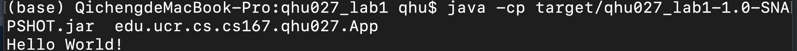
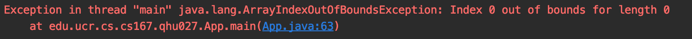
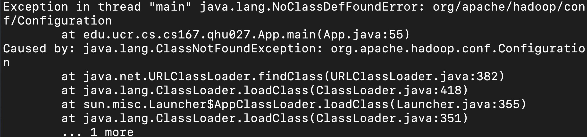
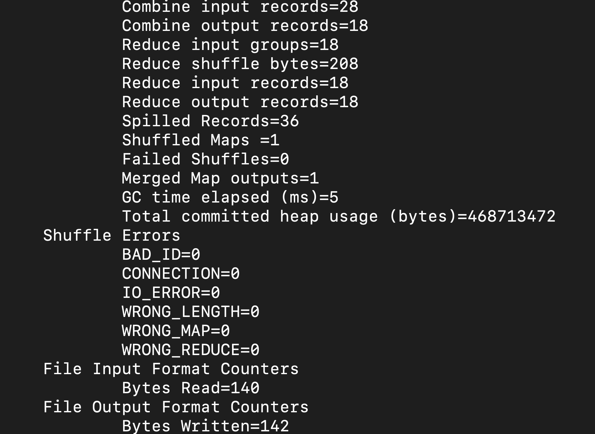

# Lab 1

## Student information
* Full name: Qicheng Hu
* E-mail: qhu027@cs.ucr.edu
* UCR NetID: qhu027
* Student ID: X675102

## Answers

* (Q1) What is the name of the created directory?

  The created directory was named 'qhu027_lab1'.

  

* (Q2) What do you see at the console output?

  The console displays 'Hello World!' as the following screenshot shows:

  

  

* (Q3) What do you see at the output?

  Due to the reason that  no input file is specified (no argument is set), the program throws an exception as the following screenshot shows:

  

  

* (Q4) What is the output that you see at the console?

  The console only displays the exit code of the program, 

  

  but the output.txt folder is createed, which includes the following files:

  

  In the part-r-00000 file, the following content is written :

  ```
  but 1
  cannot 3
  crawl  1
  do 1
  fly,   1
  forward    1
  have   1
  if 3
  keep   1
  moving 1
  run    1
  run,   1
  then   3
  to 1
  walk   1
  walk,  1
  whatever   1
  you    5
  ```

  

* (Q5) Does it run? Why or why not?

  If using java, it cannot run because of no hadoop class is found:

  

  If run using hadoop

   ```

  hadoop jar target/qhu027_lab1-1.0-SNAPSHOT.jar  edu.ucr.cs.cs167.qhu027.App input.txt output.txt 

   ```
  
  then it runs and gives the correct result:

  

  
