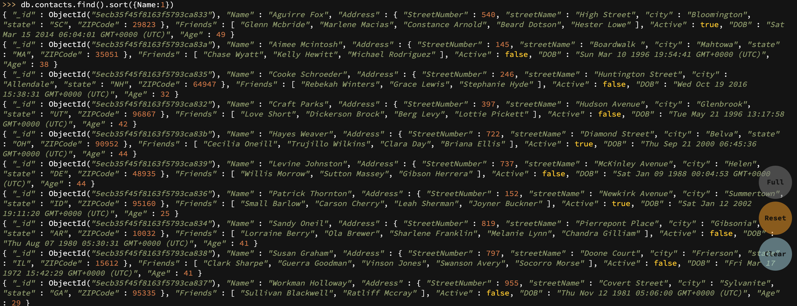
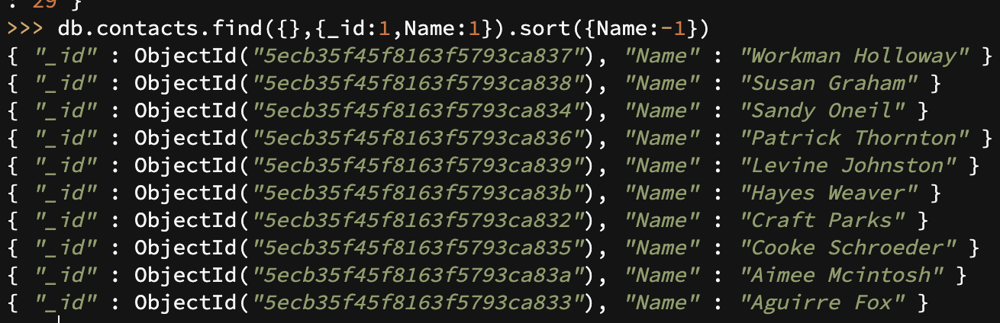
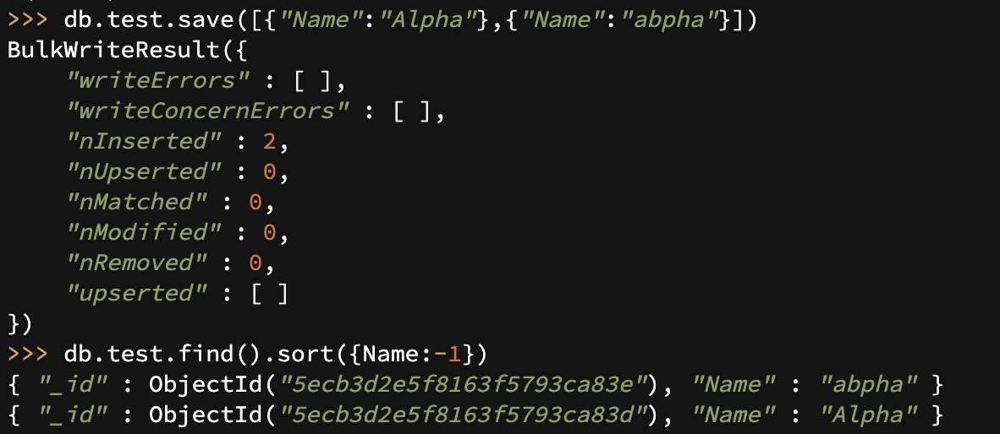
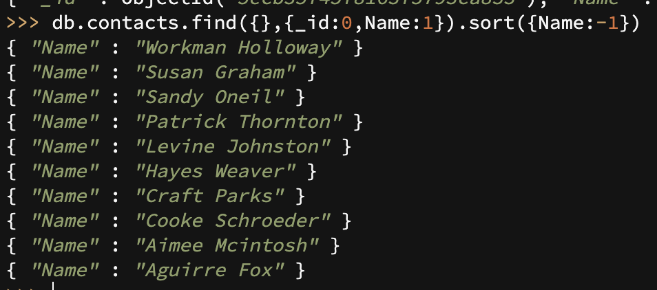
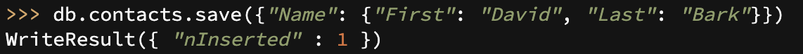
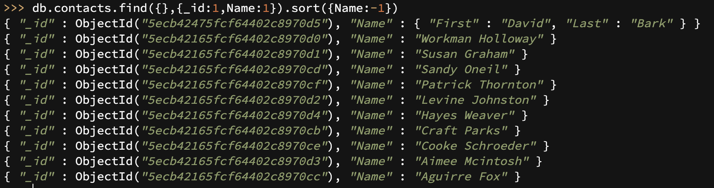
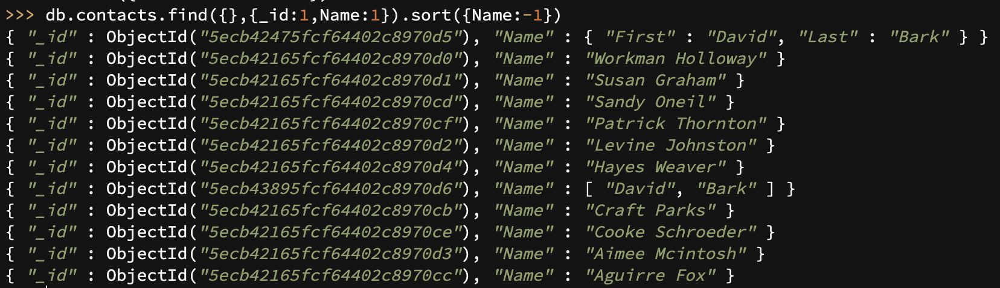
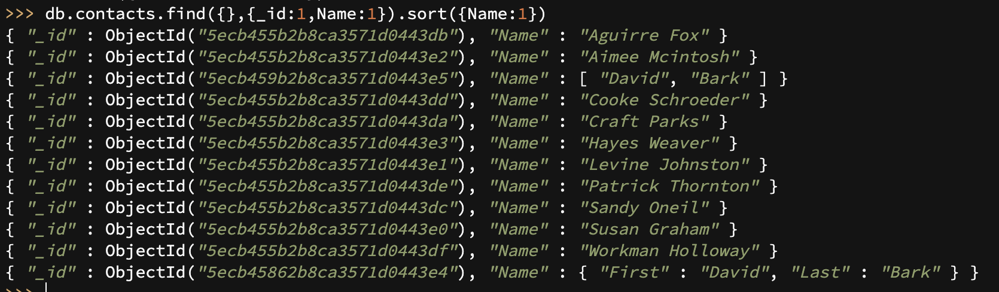
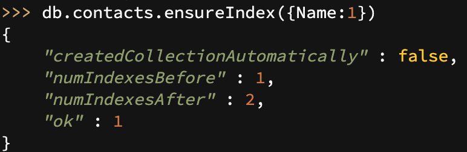

# Lab 8

## Student information
* Full name: Qicheng Hu
* E-mail: qhu027@cs.ucr.edu
* UCR NetID: qhu027
* Student ID: X675102

## Answers

* (Q1) Insert the sample JSON file into a new collection named contacts.

  Command:
  
  ```sql
  use admin
  db.createCollection("contacts")
  db.contacts.save([
    {
      "Name": "Craft Parks",
      "Address": {
        "StreetNumber": 397,
        "streetName": "Hudson Avenue",
        "city": "Glenbrook",
        "state": "UT",
        "ZIPCode": 96867
      },
      /*...CopyContentFromTheJSONFile...*/
  ])
  ```
  
  The result shows that 10 records are inserted:
  
  ```json
  BulkWriteResult([
  "writeErrors" : [],
  "writeConcernErrors" : [],
  "nInserted" : 10,
  /*..OtherInformation..*/
  ])
  ```
  ÷
  
* (Q2) Retrieve all the users sorted by name.

  The command is:

  ```sql
  db.contacts.find().sort({Name:1})
  ```
  
  the result is:
  
  
  
  
  
* (Q3) List only the `id` and `name`s sorted in reverse alphabetical order by `name` (Z-to-A).

  The command is:

  ```
  db.contacts.find({},{_id:1,Name:1}).sort({Name:-1})
  ```

  the result is :

  

  

* (Q4) Is the comparison of the attribute `name` case-sensitive? Show how you try this with the previous query and include your answer.

  The comparison is case-sensitive. I tried with the following command:


  ```sql
  db.createCollection("test")
  db.test.save([{"Name":"Alpha"},{"Name":"abpha"}])
  db.test.find().sort({Name:-1})
  ```

  the result is:

  

it is sorted by reversed alphabetical order, if it is not case senitive then "Alpha" should be followed by "abpha" but it is not.


* (Q5) Repeat Q3 above but do not show the _id field.
  The command is:

  ```sql
  db.contacts.find({},{_id:0,Name:1}).sort({Name:-1})
  ```

  the result is :

  

  

* (Q6) Insert the following document to the collection. Does MongoDB accept this document while the `name` field has a different type than other records?
  The MangoDB accepts this record, as the following picture shows.
  
  
  
  
* (Q7) Where do you expect the new record to be located in the sort order? Verify the answer and explain.

  The new record appears at the first row of the result as the following figure shows:
  
  
  The new record is treated as a new type so it is separated from previous ones.


* (Q8) Where do you expect the new document to appear in the sort order. Verify your answer and explain after running the query.

 The new record appears before "Craft Parks", as the following figure shows:
  

  The new record is treated as the same type as the previous ones and is sorted using its first element of array.

  

* (Q9) Where do you expect the last inserted record, `{Name: [“David”, “Bark”]}` to appear this time? Does it appear in the same position relative to the other records? Explain why or why not.

  This record appears after "A" names before "C" names, it seems that it uses the second element "Bark" as key to sort.



* (Q10) Build an index on the Name field for the users collection. Is MongoDB able to build the index on that field with the different value types stored in the Name field?

  The index is built successfully as the following screenshot shows:
  
  
